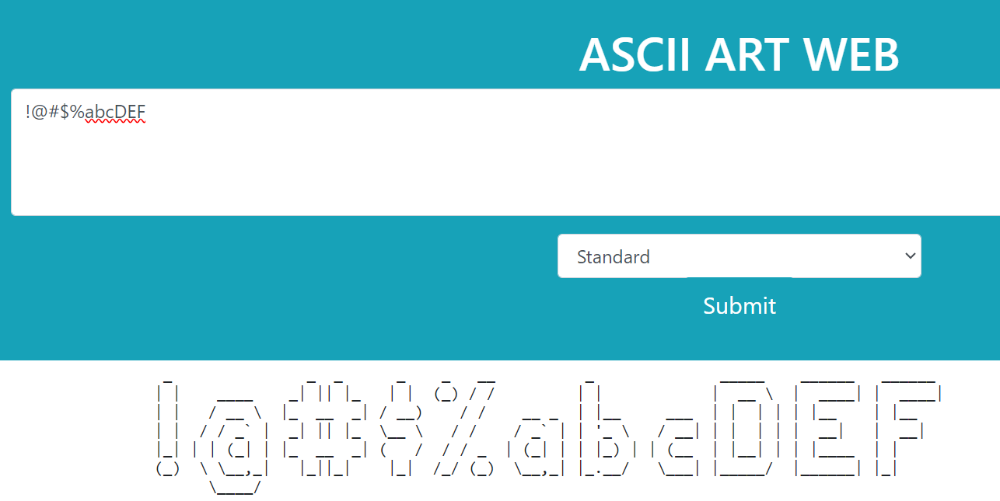
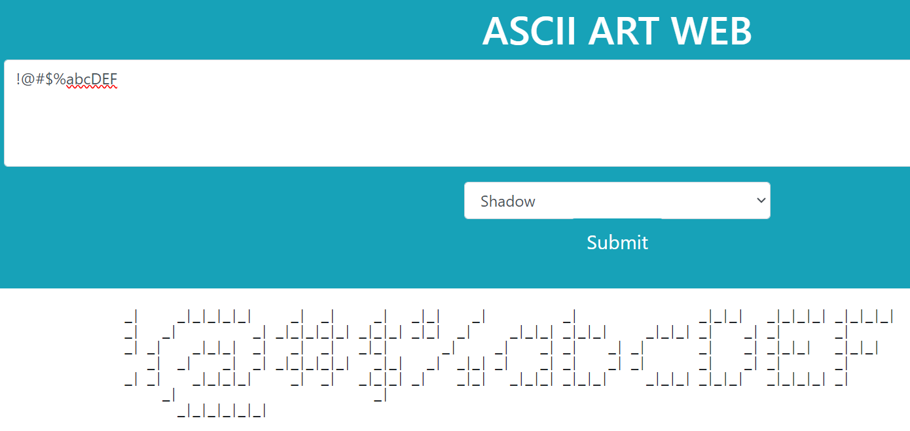

# ASCII Art Web

## Description

ASCII Art Web is a simple web application built in Go that allows users to generate ASCII art from text input using various banner styles. This application provides a web-based graphical user interface (GUI) for creating and viewing ASCII art.
There is also an option to use Docker for running the program.

## Authors

- [Deny Verves](https://github.com/TartuDen)
- [Yurii Panasiuk](https://github.com/pomog)

## Usage: 
using "standard.txt"


using "shadow.txt"


using "thinkertoy.txt"


### FORGOT WSL SUDO PASSWORD? !!!
If you've forgotten your WSL SUDO password, use Windows CMD to reset it:

```bash
wsl --user root
passwd <username>
exit
```
### Docker Desktop uses WSL 2 as the default backend for running Linux containers. Ensure that WSL 2 is enabled on your Windows machine.

```bash
sudo apt-get update
sudo apt-get install -y docker.io
docker --version
```
got: Docker version 24.0.5, build 24.0.5-0ubuntu1~22.04.1

restart
```bash
docker info
```
Client:
Version:    24.0.5
Context:    default
Debug Mode: false

Server:
ERROR: Cannot connect to the Docker daemon at unix:///var/run/docker.sock. Is the docker daemon running?
errors pretty printing info

### INSTALL DOCKER WINDOWS

1. download and install https://docs.docker.com/desktop/install/windows-install/
2. sing up
3. Start Docker Desktop

use WSL terminal
```bash
docker info
```
### now it works

### to build Container
```bash
docker build -t ascii-art-web-dockerize .
```
  install requierments

### to run Container
```bash
docker run --name=ascii-art-web-dockerize -p 80:8080 ascii-art-web-dockerize
```

## type in browser for Testing
http://localhost/docker
or
localhost:80

### to stop Container
```bash
docker stop ascii-art-web-dockerize
```

### to prune Container
```bash
docker builder prune -a
```
--- Clean Build Context !!!

### comments 
sudo systemctl start docker 	
	-- When you run this command, it starts the Docker service,
	which allows you to use Docker commands to create and manage containers.

sudo systemctl enable docker
	--Running this command ensures that Docker starts automatically whenever you restart your system. 
 
sudo usermod -aG docker <your_username>
	-aG docker: These are options for usermod:
		-a: It appends the user to the specified group(s) without removing them from any other groups.
		G docker: This specifies the group to which you want to add the user, in this case, the "docker" group.	
	--Adding your user to the "docker" group grants you permission to run Docker commands without needing to use sudo.
	This is important for convenience and avoiding the need to constantly use sudo when working with Docker.


